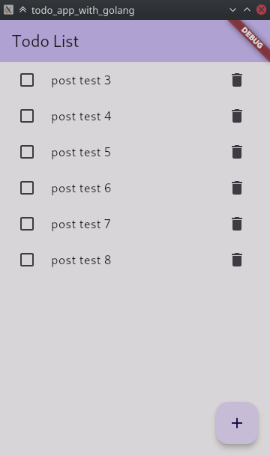
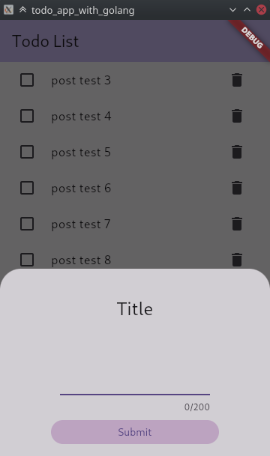
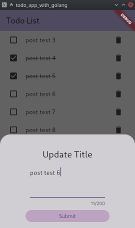

# todo_app_with_golang

A simple Flutter TODO app using GoLang with Gin framework for backend.

for running the backend, use `go run main.go` in the backend directory.

home page

add todo

edit todo

